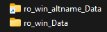
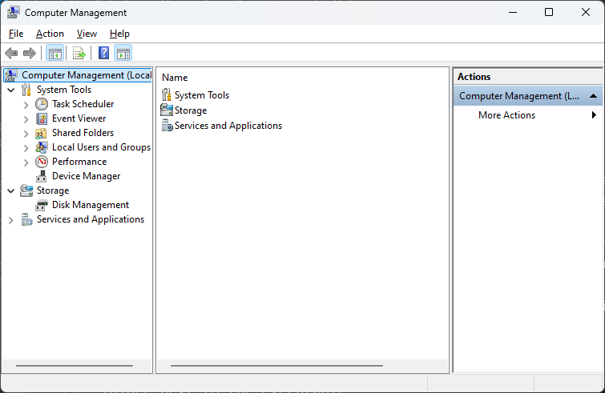
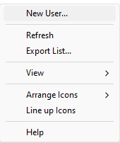
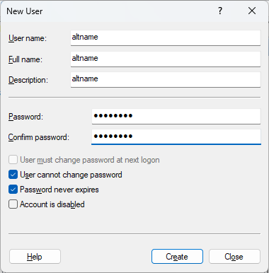
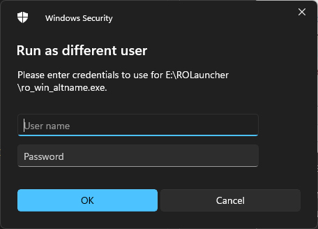

# How to run multiple instances of the ROM PC client to run your students easily

> ## If you are not interested in how this works and just want it to work, [download](CreateInstance.bat) the script, save it to your ROM folder and run it to create instances. Script is explained [here](#automating-all-this)

It is possible to run multiple clients side by side, with only a single ROM installation, so it doesn't use up 10gb of disk space per client. Also you do not have to login every time you start up the client. This guide will [first](#running-multiple-clients) explain the tech behind these 2 functions (running multiple clients, not having to login every time), and [then](#not-having-to-fill-in-your-login-information-every-time-for-every-client) show a way to automate this. This guide is a little bit technical, but the automated way in the end is a little bit less technical. Also I will not provide any executables with a nice user interface you can just run, as you should not just run executables made by others on your computer without reading the code behind it. By providing a script you can read how it works, and that it does not break your computer

> In this guide, I will be using `altname` as a name for your alt. What name you use here doesn't matter (can be `cousin`, `alt`, `little_nephew`), as long as you use the same name everywhere. If you want to add a 3rd account, use a different word. The windows account name and the executable name don't **have** to match, but, it is not a bad thing to have everything match.

## Running multiple clients

ROM has a check in it so that if you run the same executable twice, it won't start a second time. This is standard for unity games, and is checked by filename and file path.

In order to get around this, you'll have to copy the `ro_win.exe` file. You can either copy the entire ROM directory, but it is easier to copy it in the same directory and rename the file. Personally I use the naming scheme `ro_win_altname.exe`, to keep track of the name of your alt. If you do this though, the .exe won't work anymore and it will give an error:

```
There should be 'ro_win_altname_Data'
folder next to the executable
```

Now we could make a copy of the `ro_win_Data` directory and rename it to `ro_win_altname_Data`, but this is a waste of disk space, and it would mean that you would have to patch and update both folders. Fortunately, windows has a special system for this, called *symbolic link*. A symbolic link is basically a copy, without taking up any disk space. Any change in one of the links will be reflected in all of the links. This is unfortunately not available from the windows user interface, and you will have to use the **command line** prompt to make a symlink.
In order to make a link, you can open a command prompt, change to the ROM directory and use
```
mklink /d ro_win_altname_Data ro_win_Data
```
This will show up in your explorer like a folder, but with a shortcut arrow



This is a process you can do for every alt you'd like to use, and create as many symbolic links as you want. After making this 'copy', you can just run the 2 executables to start either client. It is best to name them with a descriptive name (so the name of your alt), but try to **not use spaces**. I didn't test using spaces and it might mess up some of the automated scripts you can use later

## Not having to fill in your login information every time for every client

ROM stores its login credentials in the application data folder in side of your user account. This means, that in order to have multiple credentials stored, you can create multiple users to each store their own credentials. Unfortunately, the user interface for this is only available in windows **professional**, not in the home edition. As I don't have home edition, I can not test if the automated method does work. So, for every alt client, create a new user

1) Open **computer management** (in the start menu, just search for computer management)  
  

2) Go to `System Tools`, `Local Users and Groups`, then `Users`  
  

3) Rightclick in the list of users, and select `New User`  
  

4) Enter a User Name, a password, confirm the password, and make sure the user can not change password, that it isn't expired and that the account is not disabled  
    
  for convenience, again, try to use the name of your alt(no spaces)

5) After creating the user, go to your ROM folder, and **shift+rightclick** on the `ro_win_altname.exe` file. You should have extra options, including "run as different user"  


6) You should get a popup asking for the credentials. Fill in the username and password you created, and you will get a fresh ROM client!  


## Automating all this

Automating this is done in 2 parts, automatic client instance creation, and automatic starting (with the correct account running the correct executable)

Save this as a batch file and put it in your RO:M directory (the one that has `ro_win.exe` in it). If you have it saved in your `Program Files` directory, you might have to be administrator to save it there

[download](CreateInstance.bat) this script here
```batch
@echo off
net session >nul 2>&1
IF %ERRORLEVEL% EQU 0 (
  echo Running as admin
) else (
    echo Failure: Current permissions inadequate.
    pause
    exit
)

set /P name="Enter your alt name (don't use spaces): "
if "%name%" == "" (
    echo Failure: Please enter a name
    pause
    exit
)

cd /d %~dp0
net user %name% %name% /add
mklink /d ro_win_%name%_Data ro_win_Data
copy ro_win.exe ro_win_%name%.exe

ECHO cd /d %~dp0 > %name%.bat
ECHO runas /savecred /user:%name% ro_win_%name%.exe >> %name%.bat
echo Done! you can now close this window if you don't see any errors
pause
```

After saving/downloading the script, run this script as **administrator** by right-clicking it, and click 'run as administrator'. The script will not run if it is not ran as administrator, as administrator is required to make a new user on your computer

This script will ask for a name, then create a user with that name on your computer, copy the executable, make a link, and create a new startup file to start your new instance with the proper user. The user created will be made with the password set to the name of that character, and you will have to enter this the first time you run

After that, just run the batch file with the name or your alt that you entered

## Help!

1) I try to login but it isn't working  
  If you are trying to login, and it is not logging in, this is because the new user does not have access to your browser. Some browsers install in the user's home directory, and can not be ran by other users. ROM does not give a proper error if it can not open the browser. There are 2 workarounds
  - Temporarily set your default browser to edge (edge works by default for all users). After logging in you can set it back to your normal browser
  - Copy the login token from your normal client. The login information is stored in `C:\Users\user\AppData\LocalLow\X_D_ Network Inc_\Ragnarok M` (replace user with your computer's username). You can copy this folder to `C:\Users\altname\AppData\LocalLow\X_D_ Network Inc_\Ragnarok M`, where altname is your alt's name. These folders are hidden though, so you will have to show hidden files in order to see them

2) Those new users appear on my login screen, and in the switch user screen, and I don't want that  
  Easy, after logging them in, go to the `computer management` tool, find the user that was created, edit it, and remove it from the **Users** group. That will remove it from the login screen too

3) These windows are messy! how do I organize them?  
  For this, I use [FancyZones](https://learn.microsoft.com/en-us/windows/powertoys/), built into ms powertoys. You can draw a grid, and snap your windows to this grid while holding shift. ROM will actually resize to any aspect ratio with this tool, so you can organize them any way you like

4) I quit playing the game. How do I get rid of this?  
  Don't quit the game ☹️. But through the computer management panel, you can just remove the users you made, and you can then delete their user-folders from your hard drive to "uninstall" all this. You can always re-add the users if you decide to come back

5) I am even more lazy. Can I start multiple clients at the same time?
  Of course you can. The .bat files that are created, can be opened in any text editor and combined into a single .bat file, that will start all of your clients with 1 click