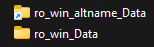
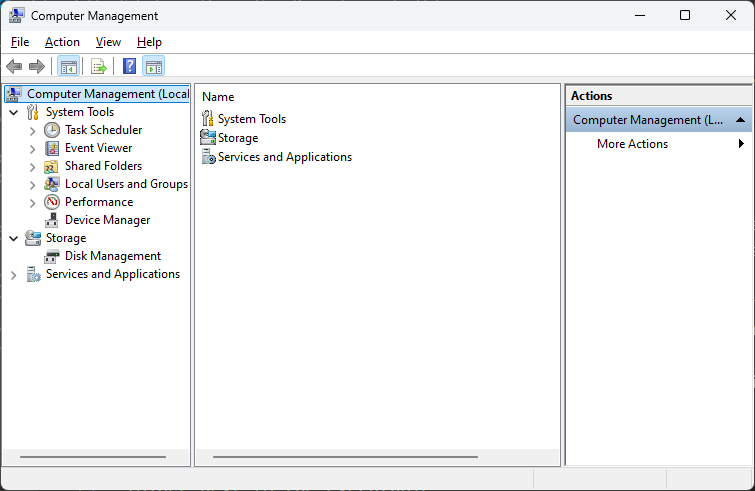
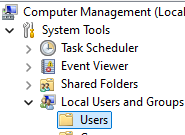
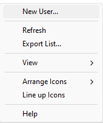
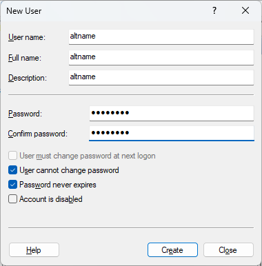
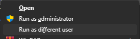
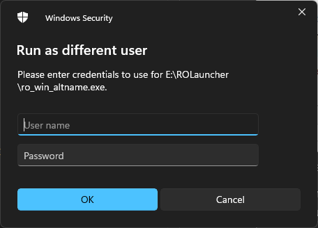

  

[[En](index)][[Pt(br)](index_br)]


# Como rodar múltiplas instâncias do Client de PC do ROM pra usar seus alunos facilmente

> ## Se você não está interessado em como isso funciona e só quer que funcione, faça o [download](CreateInstance.bat) do script, salve na pasta do ROM e execute pra criar as instâncias. O script é explicado [aqui](#automating-all-this)

É possível rodar múltiplos clientes lado a lado, apenas com uma única instalação do ROM, pra que não ocupe 10gb de espaço em disco por cliente. Também você não precisará fazer login toda vez que iniciar um novo cliente. Este [guia](#running-multiple-clients) explicará a tecnologia por de trás destas 2 funções (rodando múltiplos clientes, sem precisar fazer login todas as vezes), e [então](#not-having-to-fill-in-your-login-information-every-time-for-every-client) demonstrar como automatizar isso. Este guia é um pouco técnico, mas a forma de automação no fim é um pouco menos técnico. Também eu não vou providenciar um executável com uma interface de usuário bonitinha pra você rodar, porque você não deveria rodar executáveis feitas por outras pessoas sem ler o código por de trás do programa. Providenciando o script, você poderá ler como funciona, e isso não vai quebrar seu computador.

> Neste guia, Eu usarei `nomealt` como um nome para o seu alt. O nome que você vai usar aqui não importa (pode ser `primo`, `alt`, `maniçoba`), desde que você use o mesmo nome em todos os lugares. Se você quiser adicionar uma terceira conta, use uma palavra diferente. O nome da conta do Windows e o nome do executável **não precisam** ser idênticas, mas, não é ruim deixar tudo combinando.

## Rodando múltiplos clientes

ROM tem uma verificação que se você rodar o mesmo executável duas vezes, a segunda instância não irá iniciar. Isso é padrão para jogos feitos em Unity, e é verificado o nome e caminho do arquivo.

Para contornar isso, você precisará ter uma cópia do arquivo `ro_win.exe`. Você pode copiar todo o diretório do ROM, mas é mais fácil fazer a cópia no mesmo diretório e renomar o arquivo. Pessoalmente eu prefiro usar o esquema do nome como `ro_win_nomealt.exe`, pra saber qual o nome do alt que ele pertence. Se você fizer isso, o .exe não irá mais funcionar e te dará o seguinte erro:

```
There should be 'ro_win_nomealt_Data'
folder next to the executable
```

Agora podemos fazer a cópia da pasta `ro_win_Data` e renomear para `ro_win_nomealt_Data`, mas isso é um gasto de espaço em disco desnecessário, e significaria que você precisaria atualizar as duas pastas. Felizmente, o Windows tem um sistema especial para isso, chamado *link simbólico*. Um link simbólico é basicamente uma cópia, sem consumir espaço em disco. Qualquer alteração em um dos links irá refletir em todos os links. Infelizmente, isso não é possível de fazer pela interface do usuário no Windows, e você terá que usar o **command prompt** pra fazer o symlink.
Para fazer o link, você abrirá o command prompt, trocará para o diretório do ROM (usando `cd nome_da_pasta`) e usar

```
mklink /d ro_win_nomealt_Data ro_win_Data
```
Isso aparecerá no seu explorer como uma pasta, mas com uma flexinha de atalho.



Você pode fazer esse processo para todos os seus alts que queira usar, e criar quantos links simbólicos que queira. Depois de fazer esta 'cópia', você pode rodar 2 executáveis para cada cliente. É melhor nomeá-los com um nome descritivo (o nome do seu alt), mas tente **não usar espaços**. Eu não testei com espaçamento e isso pode ferrar com parte da automação dos scripts que você poderá usar depois.

## Não preenchendo o login toda vez para cada instância

ROM guarda as credenciais na pasta de dados do programa dentro da conta de usuário. Isso significa, que para ter múltiplas credenciais guardadas, você poderá criar múltiplos usuários para cada vez que guardar as suas credenciais. Infelizmente, a interface de usuário para isso está disponível apenas no Windows **Professional**, e não no Home Edition. Como eu não tenho esta versão, não pude testar se o método automatizado funciona. Então para cada alt que criar, crie um novo usuário.

1) Abra **gerenciamento do computador** (no menu inicial, pesquise por gerenciamento do computador ou computer management)
  

2) Vá para `Ferramentas do sistema`, `Usuários e Grupos Locais`, e depois em `Usuários`  
  

3) Clique com o botão direito na lista de usuários e selecione `Novo Usuário`
  

4) Coloque um nome pro usuário, a senha e confirme a senha, e certifique-se que o usuário não poderá trocar de senha, que não poderá expirar e a conta não está desabilitada
    
  para conveniência, novamente, tente usar o nome do seu alt(sem espaços)

5) Depois de criar o usuário, vá para sua pasta do ROM, e **shift+botão direito do mouse** no arquivo `ro_win_nomealt.exe`. Você deve ter opções extras, incluindo "Executar como um usuário diferente"  


6) Aparecerá um popup perguntando pelas suas credenciais. Preencha o usuário e senha que criou, e você terá uma instância do ROM nova!  


## Automatizando tudo isso

Automatização é feito em 2 partes, criação automática de instância do client, e inicialização automática (com a conta correta rodando no executável correto)

Salve o arquivo batch (.bat) no seu diretório do ROM (o que tem `ro_win.exe`). Se você tem esse diretório nos `Arquivos de Programas`, você talvez precisará dar permissão de administrador para salvar

Faça o [download do script aqui](CreateInstance.bat)
```batch
@echo off
net session >nul 2>&1
IF %ERRORLEVEL% EQU 0 (
  echo Rodando como admin
) else (
    echo Falha: Permissões atuais inadequadas.
    pause
    exit
)

set /P name="Entre o nome do seu alt(sem espaços): "
if "%name%" == "" (
    echo Falha: Por favor, coloque um nome
    pause
    exit
)

cd /d %~dp0
net user %name% %name% /add
mklink /d ro_win_%name%_Data ro_win_Data
copy ro_win.exe ro_win_%name%.exe

ECHO cd /d %~dp0 > %name%.bat
ECHO runas /savecred /user:%name% ro_win_%name%.exe >> %name%.bat
echo Tudo feito! Pode fechar esta janela se voce nao ve nenhum erro
pause
```

Após salvar/baixar o script, rode este script como **administrador** clicando com o botão direito do mouse nele, e selecionar a opção 'Executar como Administrador'. O script não irá rodar se não tiver permissão de administrador, como administrador é necessário para criar um novo usuário no seu computador

Esse script irá perguntar por um nome, e depois criará um usuário com este nome no seu computador, copie o executável, faça um link, e crie um novo arquivo de inicialização para iniciar sua nova instância com o usuário apropriado. O usuário criado terá a senha configurada para o nome daquele personagem, e você preencherá a primeira vez que rodar a instância

Depois disso, rode o arquivo batch (.bat) com o nome que você colocou

## Ajuda!

1) Eu tento logar mas não está funcionando
  Se você está tentando logar, e não está logando, é porque o novo usuário não tem acesso ao seu browser. Alguns browsers instalam no diretório raiz do usuário, e não podem ser executados por outros usuários. ROM não da um erro apropriado se não consegue abrir o browser. Tem duas formas de contornar está situação  
  - Temporariamente configurar seu browser padrão para o Edge (Edge funciona, por padrão, para todos os usuários). Depois de logar, você pode configurar para o seu browser de preferência de volta
  - Copiar o token de login do seu client normal. A informação de login é guardada em `C:\Users\user\AppData\LocalLow\X_D_ Network Inc_\Ragnarok M` (troque o 'user' pelo nome do usuário do seu computador). Você pode copiar esta pasta para `C:\Users\nomealt\AppData\LocalLow\X_D_ Network Inc_\Ragnarok M`, aonde o 'nomealt' é o nome do seu alt. Estas pastas estão escondidas, então você precisará habilitar ver pastas e arquivos escondidos.

2) Esses novos usuários aparecem na minha tela de login do Windows, e na hora de trocar de usuário também, e eu não quero isso  
  Facil, depois de logar neles, vá para a ferramenta de `Gerenciamento do computador`, encontre o usuário que foi criado, edite-o, e remova do grupo de **Usuários**. Isso irá remove-los da tela de login também

3) Estas janelas são muito bagunçadas! Como eu organizo eles?  
  Para isso, eu uso [FancyZones](https://learn.microsoft.com/pt-br/windows/powertoys/). Você pode desenhar um grid e ajustar suas janelas neste grid segurando Shift. ROM vai redimensionar proporcionalmente com a tela com esta ferramenta, assim você pode organizar do jeito que preferir

4) Eu parei de jogar. Como eu me livro disso?  
  Não para de jogar ☹️. Mas através do painel de 'Gerenciamento do Computador', você pode remover os usuários que você fez, e você pode deletar as pastas do usuário que criou do seu HD para "desinstalar" isso tudo. Você poderá readicionar os usuário se decidir voltar para o jogo

5) Eu sou ainda mais preguiçoso do que imagina. Posso iniciar múltiplas instâncias ao mesmo tempo?  
  Claro que pode. Os arquivos .bat criados, podem ser abertos em qualquer editor de texto e combinado em um único arquivo .bat, isso iniciará todos as instâncias com apenas 1 click

  